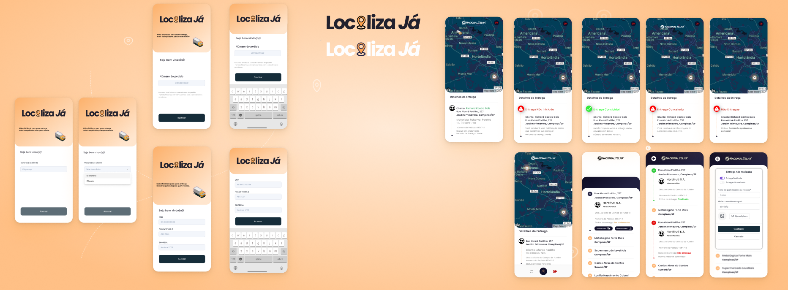
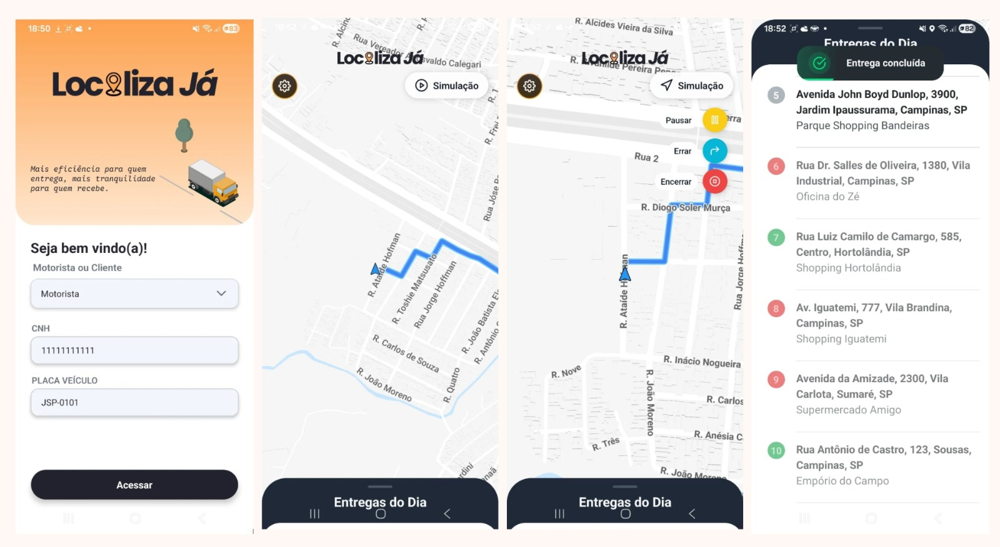
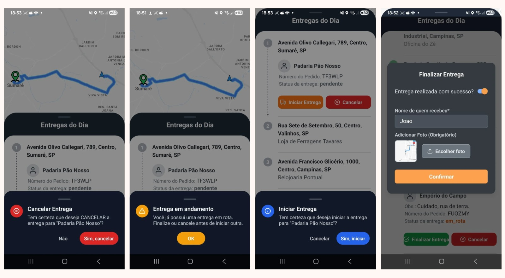
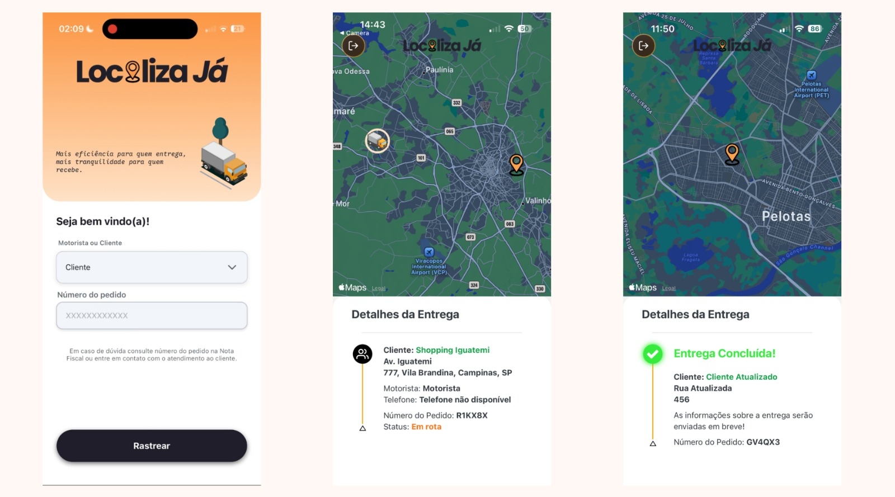
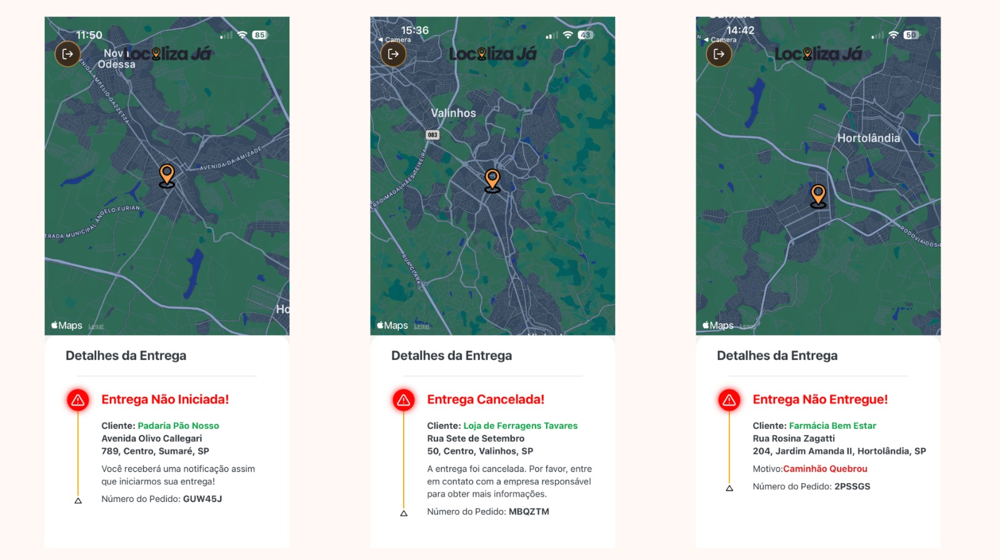

  # 🚚 Localiza-Já – Sistema Completo (Mobile + Backend + IoT)

  O **Localiza-Já** é um sistema de rastreamento de entregas em tempo real, focado na experiência do **motorista de entregas**.

  Ele combina três fontes de localização:

  1. **GPS real do celular**  
  2. **Dispositivo IoT (ESP32 + GPS)** embarcado no veículo  
  3. **Simulador de rota** com comportamento próximo a apps como Google Maps / iFood Entregador  

  O objetivo é demonstrar, de forma profissional e didática, como integrar:

  - **Aplicativo mobile** (React Native / Expo)  
  - **Backend REST** em Flask + PostgreSQL  
  - **Dispositivo IoT** publicando coordenadas reais para a API  

  ---

  ## 🎨 Conceito visual (protótipo vs. app)

  > Protótipo no Figma

  

  > Resultado Final
  
  
  
  


  ---

  ## 🧩 Módulos do sistema

  O projeto é dividido em três partes principais:

  **Frontend – App do Motorista (/frontend)**

  - Desenvolvido em React Native (Expo).

  - Tela de login (CNH + placa) e tela de mapa com rota, entregas do dia e simulação.

  **Backend – API REST (/backend)**

  - Desenvolvido em Python + Flask + SQLAlchemy + PostgreSQL.

  - Gerencia motoristas, entregas, localizações e regras de negócio (status, prova de entrega, etc.).

  **IoT – Firmware ESP32 + GPS (/iot/arduino2.ino)**

  - Lê coordenadas do módulo GPS.

  - Sincroniza hora via NTP.

  - Monta JSON e envia periodicamente para o backend em /localizacoes/iot.

  ---

  ## 🏗 Arquitetura de alto nível

  ```markdown
  +------------------+          +----------------------+          +----------------------+
  |  App do Motorista|          |       Backend        |          |     Dispositivo IoT  |
  |  (React Native)  |  REST    |   (Flask + Postgres) |   REST   |   (ESP32 + GPS)      |
  +--------+---------+ <------> +----------+-----------+ <------> +----------+-----------+
          |                                ^                                |
          |                                |                                |
          |      /login, /entregas,        |                     POST /localizacoes/iot
          |      /localizacoes/motorista   |                          (JSON com GPS)
          v                                |                                |
    Tela de mapa                    Tabelas: usuario, entrega,      Módulo GPS
    (GPS / IoT / Simulação)         localizacao, etc.
  ```

  ---

  ## 🔌 Comunicação entre Frontend, Backend e IoT

  - **Login e sessão**

    - O app chama o endpoint de login no backend, informando CNH + placa.

    - O backend valida o motorista e retorna um token JWT, que é salvo no AsyncStorage.
    - As chamadas seguintes do app enviam o token no header para autenticação.

  - **Entregas do dia**

    - O frontend consome a rota de entregas para o motorista logado.
    - O backend devolve a lista com status, endereço, número do pedido, etc.

  - **Localização do IoT**

    - O ESP32 + GPS envia periodicamente um JSON para POST /localizacoes/iot com:
    **_motorista_id, entrega_id, latitude, longitude, data_hora._**
    - O backend grava isso na tabela de localizações.

  - **Mapa do motorista**

    - O app consulta GET /localizacoes/motorista/:id para buscar a última localização vinda do IoT.
    - Essa posição pode ser usada em conjunto com o GPS do celular ou substituindo-o, dependendo do modo escolhido na tela.

  ---  

  ## 🛠 Tecnologias principais

  ### 📱 Frontend (App do motorista)

  - **React Native (Expo)** - base do app mobile.
  - **TypeScript** - tipagem estática e segurança de tipos.
  - **Expo Router** - navegação entre tela de login e tela de mapa.
  - **react-native-maps** - renderização do mapa, rota e trilha percorrida.
  - **expo-location** - acesso ao GPS do aparelho.
  - **react-native-reanimated** - animações suaves (login, FAB, bottom sheet, etc.).
  - **Axios** - comunicação HTTP com o backend, com interceptors de token.

  ### 🖥 Backend (API REST)

  - **Python 3 + Flask** - framework principal da API.
  - **Flask SQLAlchemy** - ORM para acesso ao PostgreSQL.
  - **PostgreSQL** - banco relacional de produção / estudo.
  - **Flask-Limiter, Flask-CORS, etc**. - segurança e controle de uso.
  - **Postman Collection** - arquivo .postman_collection.json com exemplos de requisições.

  Modelos principais:
  - **Usuario** → Motorista (nome, CNH, placa, telefone). 
  - **Entrega** → Pedido com status, endereço, cliente, motivo, foto de prova, etc. 

  ### 📡 IoT (ESP32 + GPS)

  - **ESP32 Dev Module**
  - **Arduino IDE 2.x** - desenvolvimento e upload do firmware.
  - Bibliotecas:
    - **WiFi.h** - conexão com a rede.
    - **HTTPClient.h** - envio dos POST para o backend.
    - **TinyGPSPlus.h** - leitura e parsing das sentenças NMEA do módulo GPS.
    - **ArduinoJson.h** - montagem do JSON com a localização.

    ---

  ## 🗂 Estrutura de pastas (nível geral)

  ```markdown
  Localiza-Ja/
  ├── backend/              # API Flask + Postgres (entregas, motoristas, localizações)
  ├── frontend/             # App do motorista (React Native + Expo)
  └── iot/
      └── arduino2.ino      # Firmware do ESP32 + GPS (rastreio IoT)
  ```

  > Dentro de cada pasta existem READMEs específicos detalhando frontend, backend e IoT.

  ---

  ## 🧭 Modos de fonte de localização (GPS, IoT e Simulação)

  A tela de mapa sempre trabalha com uma posição **"oficial"** do motorista, mas a origem dessa posição pode mudar de acordo com o modo:

  **1. Simulação LIGADA**

  - Tudo vem do simulador de rota (hook useSimulatedNavigation).
  - GPS do celular e IoT são ignorados para desenhar o ponteiro.
  - Ideal para apresentações, testes e demonstrações.

  **2. Simulação DESLIGADA + IoT ATIVO**

  - Latitude/longitude vêm da última posição enviada pelo ESP32 (hook useIotLocation).
  - Heading e velocidade vêm do GPS do celular (hook useDriverLocation).
  - Resultado: rota real do IoT com movimento fluido, parecido com apps de navegação.

  **3. Simulação DESLIGADA + IoT DESATIVADO**

  - Toda a localização é lida diretamente do GPS do celular.
  - É o modo "somente smartphone".

  ---

  ## ▶ Como rodar o projeto localmente

  > - ⚠️ Atualmente **todo o projeto roda em ambiente local** (backend, banco, app mobile e IoT).
  > - A estrutura foi pensada para futuramente ir para >nuvem (API, banco, app em loja, etc.).

  ### ✅ Pré-requisitos
  - **Git**
  - **Python 3.10+**
  - **PostgreSQL instalado e um banco criado (ex.: localizaja)**
  - **Node.js + npm**
  - **Expo CLI / npx expo**
  - **Arduino IDE 2.x (para usar o firmware IoT com ESP32 - opcional)**

  ### 1. Clonar o repositório

  ```markdown
  git clone https://github.com/seu-usuario/Localiza-Ja.git
  cd Localiza-Ja
  ```

  ### 2. Backend - instalar dependências e configurar banco

  Dentro da pasta backend/:

  ```markdown
  PS C:\dev\Localiza-Ja> cd .\backend\
  PS C:\dev\Localiza-Ja\backend> python -m venv venv
  PS C:\dev\Localiza-Ja\backend> venv\Scripts\activate
  (venv) PS> pip install -r requirements.txt
  ```

  Configure as variáveis de ambiente (por ex. em um **.env** ou diretamente no ambiente):

  - **DATABASE_URL** → string de conexão do PostgreSQL
  - **JWT_SECRET_KEY** → chave para tokens
  - **FLASK_ENV** → development

  Depois, rode o seed para criar as tabelas e dados de exemplo:

  ```markdown
  (venv) PS> flask --app main seed-db
  ```

  Saída esperada (similar a):

  ```markdown
  Limpando todas as tabelas...
  Tabelas limpas com sucesso.
  Usuário 'João da Silva' criado.
  10 entregas de teste foram criadas.
  0 localizações de teste foram criadas.
  ```

  Por fim, suba o servidor:
  ```markdown
  (venv) PS> python main.py
  ```

  O backend deve exibir algo como:
  ```markdown
  Backend em: http://192.168.X.X:5000 (LAN)  |  http://127.0.0.1:5000 (localhost)
  ```

  > - Anote o IP de LAN (ex.: http://192.168.2.103:5000), ele será usado no frontend e no ESP32.


  ### 3. (Opcional) Subir o dispositivo IoT (ESP32 + GPS)

  - Abra o **Arduino IDE** e carregue o arquivo **iot/arduino2.ino**.
  - Ajuste no código:
    - **ssid** e **password** → WiFi 2.4 GHz da sua rede local.
    - **motoristaId** e **entregaId** → IDs que existem no banco (pode pegar do seed).
    - **apiUrl** → IP do backend, ex.:

  ```markdown
  const char* apiUrl = "http://192.168.2.103:5000/localizacoes/iot";
  ```

  - Selecione a placa **ESP32 Dev Module** e a porta **COMx / ttyUSBx**.
  - Compile (✓) e depois faça Upload (→).
  - Abra o **Serial Monitor** (115200 baud) para ver logs:
    - Conexão WiFi
    - Fix de GPS
    - JSON enviado e resposta HTTP do backend

  ### 4. Frontend - instalar dependências e rodar o app

  Em outro terminal:

  ```markdown
  PS C:\dev\Localiza-Ja> cd .\frontend\
  PS C:\dev\Localiza-Ja\frontend> npm install
  PS C:\dev\Localiza-Ja\frontend> npx expo start --clear
  ```

  Antes de rodar, ajuste a **baseURL do Axios** (src/services/api.ts) apontando para o IP do backend:
  ```markdown
  export const api = axios.create({
    baseURL: "http://192.168.2.103:5000", // ajuste para seu IP
    timeout: 15000,
  });
  ```

  Depois:
  - Abra o app Expo Go no Android.
  - Escaneie o QR Code do terminal.
  - Faça login usando a CNH e placa geradas pelo seed (usuário de exemplo).


  ### 5. Fluxo básico de uso

  - **1.** Suba o **backend** e garanta que o banco está criado e populado.
  - **2.** (Opcional) Ligue o **ESP32 + GPS** se quiser rastreamento via IoT.
  - **3.** Rode o **app mobile** com Expo.
  - **4.** Faça login e vá para a tela de mapa.
  - **5.** Controle:
    - Simulação via botão Simulação (start, pause, errar rota, parar).
    - IoT ON/OFF via controle na tela (para usar só celular, só IoT, ou simulação).

  ---

  ## ☁️ Sobre implantação e evolução futura

  Atualmente, todo o ecossistema roda em ambiente local:

  - Backend Flask em uma máquina da rede local.
  - Banco PostgreSQL local.
  - App mobile rodando via Expo Go.
  - Dispositivo IoT apontando para o IP local do backend.

  O projeto foi estruturado para, no futuro, evoluir para:

  - Backend em nuvem (Render, Railway, AWS, GCP, etc.).
  - Banco gerenciado (RDS, Cloud SQL, Supabase, etc.).
  - App publicado em lojas (Play Store) com build standalone.
  - IoT comunicando-se via HTTPS com domínio público / API Gateway.

  Essa arquitetura facilita testes acadêmicos, demonstrações em empresa e também abre caminho para virar um produto real com ajustes mínimos de infraestrutura.

  ## ✅ Resumo

  O **Localiza-Já** demonstra, em um projeto único:

  - Integração de mobile + backend + IoT.
  - Rastreio de entregas com diferentes fontes de localização (GPS, IoT, simulação).
  - Regras de negócio de entregas e prova de entrega com foto.
  - Arquitetura modular e organizada, pronta para crescer.